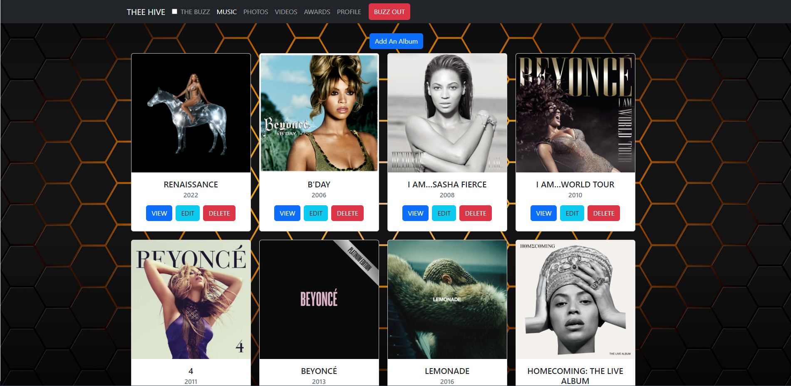
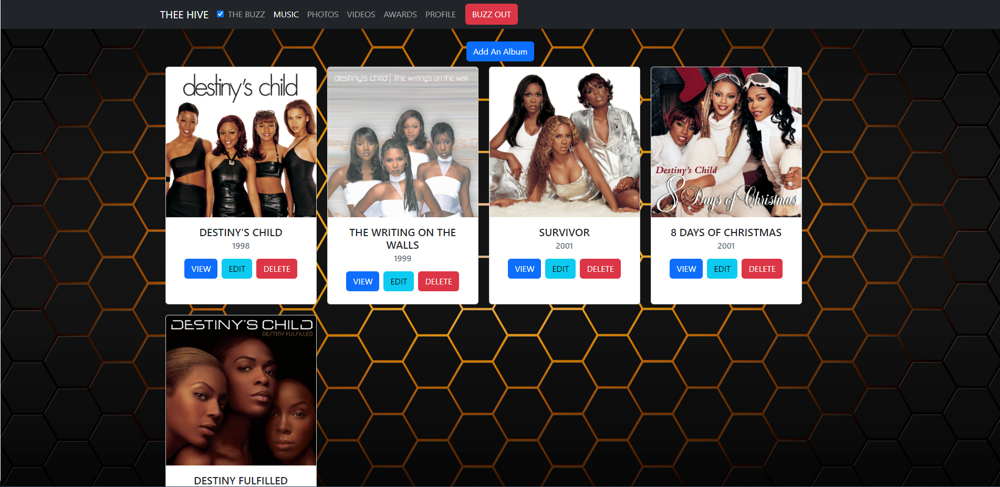
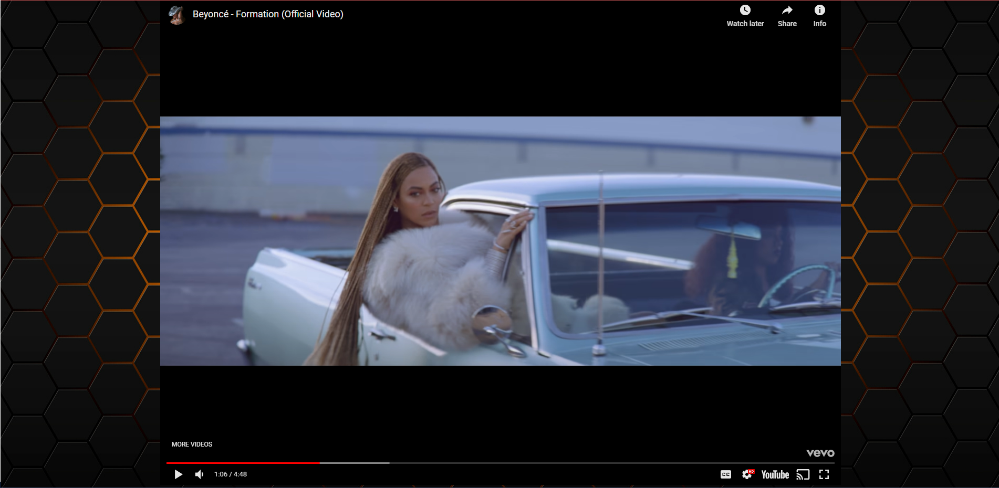

# THEE HIVE

[See THEE HIVE Live!](https://drt-next-js-template.netlify.app/)

## Overview
In the forever era of social media, you have the top contenders like Twitter, Reddit, Instagram, Facebook, etc. All great places to socialize but not specifically focus on the topic of your interest ONLY. In this case, it is the Queen Bee, Beyoncé! THEE HIVE is the ultimate Beyoncé fansite! This app allows "The B Hive" fans to share their love for the Queen in a safe space and keeps the sting away from the haters.

## Features

+ Users login to the app using Google Authentication
+ Users can create catalogs for albums, photos, videos, and awards
+ Users can view a single album, photo, or video
+ Users can add songs to a single album
+ Users can update or delete any album, song, photo, video or award
+ Users can delete a single album and it's associated songs at once
+ Users can view a video and play the video within the app
+ Users can toggle between catalogs for Beyoncé or her successful girl group, Destiny's Child

___
## Swarm THEE HIVE Yourself

1. Set up a Firebase project.
2. Clone THEE HIVE to your local machine.

        git@github.com:dimitricbrown/THEE-HIVE.git

3. Move into your directory.

        cd THEE-HIVE

4. In the root directory of the CLI, run

        npm install or npm i

5. When VSCode has opened the application, create a .env file at the root of the project and paste the following keys into the .env file:

        NEXT_PUBLIC_FIREBASE_API_KEY=""
        NEXT_PUBLIC_FIREBASE_AUTH_DOMAIN=""
        NEXT_PUBLIC_FIREBASE_DATABASE_URL=""
        NEXT_PUBLIC_FIREBASE_PROJECT_ID=""
        NEXT_PUBLIC_FIREBASE_STORAGE_BUCKET=""
        NEXT_PUBLIC_FIREBASE_APP_ID=""

6. Insert your firebase configuration values to the corresponding keys in the previous step.

7. Build your firebase database with the necessary data to render in the app.

8. After completing your database, return to the CLI and run

        npm run prepare

9. To start THEE HIVE, run

        npm run dev

10. Click [http://localhost:3000](http://localhost:3000) in the terminal to open the DOM.

11. Time to BUZZ into THEE HIVE! 🐝

## Building THEE HIVE

- [Wireframe](https://www.canva.com/design/DAFja1YP23A/RF5_r-ohZgq09oLQvmLmvg/watch?utm_content=DAFja1YP23A&utm_campaign=designshare&utm_medium=link&utm_source=publishsharelink)
- [ERD](https://dbdiagram.io/d/646827fddca9fb07c46d388d)

## Contributors

+ [Dimitric C. Brown](https://github.com/dimitricbrown)
  - [LinkedIn](https://www.linkedin.com/in/dimitricbrown/)

## Peek Inside THEE HIVE

